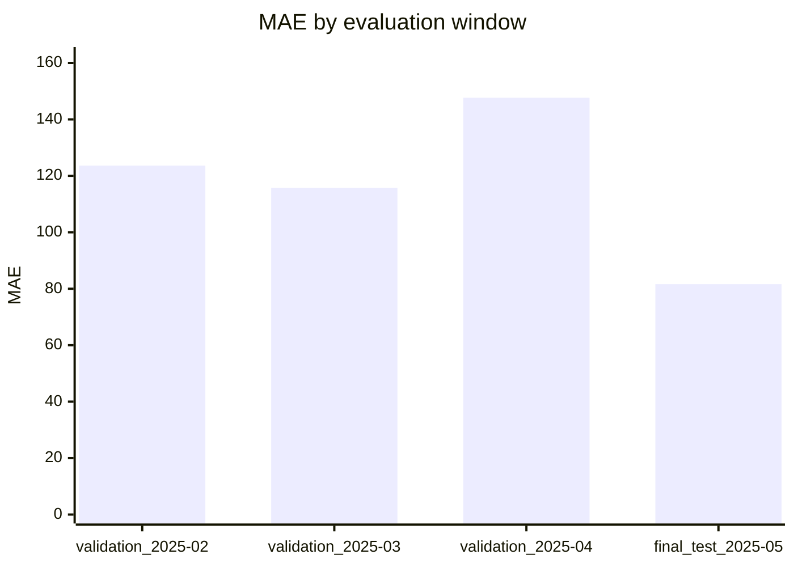
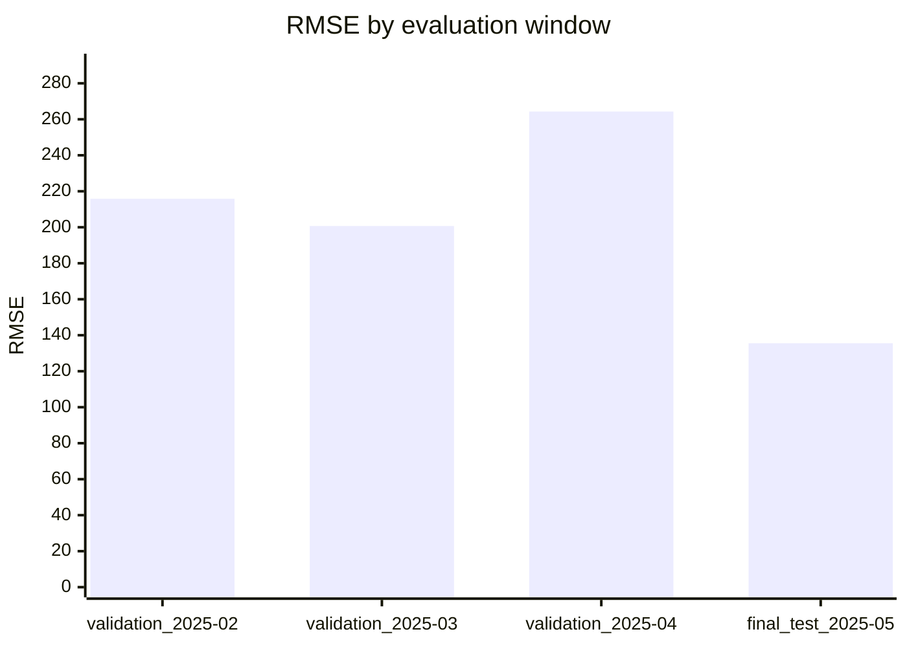
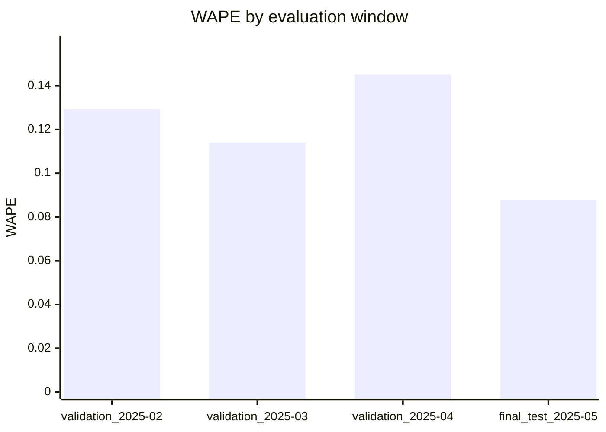

# LightGBM Evaluation Report

Source: `data\processed\real_demo\supervised_rows.csv`

Rows evaluated: 87000
Validation windows: 3

## Final test

Window: `final_test_2025-05`
Period: 2025-05-01T00:00:00+10:00 to 2025-06-01T00:00:00+10:00
Training rows: 68820

| Metric | Value |
| --- | ---: |
| Row count | 17856 |
| MAE | 81.6262 |
| RMSE | 135.5565 |
| WAPE | 0.0876 |

## Model comparison

| Window | Model | Rows | MAE | RMSE | WAPE | Relative WAPE improvement |
| --- | --- | ---: | ---: | ---: | ---: | ---: |
| final_test_2025-05 | LightGBM | 17856 | 81.6262 | 135.5565 | 0.0876 | 21.40% |
| final_test_2025-05 | Seasonal Naive | 17856 | 103.8441 | 191.4734 | 0.1114 | n/a |
| validation_2025-02 | LightGBM | 16128 | 123.6456 | 215.8044 | 0.1293 | -20.48% |
| validation_2025-02 | Seasonal Naive | 16128 | 102.6235 | 176.2095 | 0.1073 | n/a |
| validation_2025-03 | LightGBM | 17856 | 115.7404 | 200.6835 | 0.1140 | 10.53% |
| validation_2025-03 | Seasonal Naive | 17856 | 129.3562 | 270.2339 | 0.1274 | n/a |
| validation_2025-04 | LightGBM | 17280 | 147.6721 | 264.3134 | 0.1452 | 19.28% |
| validation_2025-04 | Seasonal Naive | 17256 | 183.1572 | 309.4902 | 0.1799 | n/a |

## Validation windows

| Window | Period | Training rows | Rows | MAE | RMSE | WAPE |
| --- | --- | ---: | ---: | ---: | ---: | ---: |
| validation_2025-02 | 2025-02-01T00:00:00+11:00 to 2025-03-01T00:00:00+11:00 | 17556 | 16128 | 123.6456 | 215.8044 | 0.1293 |
| validation_2025-03 | 2025-03-01T00:00:00+11:00 to 2025-04-01T00:00:00+11:00 | 33684 | 17856 | 115.7404 | 200.6835 | 0.1140 |
| validation_2025-04 | 2025-04-01T00:00:00+11:00 to 2025-05-01T00:00:00+10:00 | 51540 | 17280 | 147.6721 | 264.3134 | 0.1452 |

## Metric comparison charts

## Final test by horizon

| Horizon | Rows | MAE | RMSE | WAPE |
| ---: | ---: | ---: | ---: | ---: |
| 1 | 744 | 81.7447 | 136.0549 | 0.0877 |
| 2 | 744 | 81.7991 | 136.2985 | 0.0878 |
| 3 | 744 | 81.4078 | 134.9627 | 0.0873 |
| 4 | 744 | 81.6376 | 135.3370 | 0.0876 |
| 5 | 744 | 81.4634 | 135.6267 | 0.0874 |
| 6 | 744 | 81.1936 | 135.4557 | 0.0871 |
| 7 | 744 | 81.5294 | 135.7908 | 0.0875 |
| 8 | 744 | 81.7198 | 136.2309 | 0.0877 |
| 9 | 744 | 81.8455 | 136.3381 | 0.0878 |
| 10 | 744 | 81.9506 | 136.3710 | 0.0879 |
| 11 | 744 | 82.0555 | 136.4866 | 0.0880 |
| 12 | 744 | 81.9822 | 136.4850 | 0.0880 |
| 13 | 744 | 81.8329 | 136.2935 | 0.0878 |
| 14 | 744 | 81.6983 | 136.2021 | 0.0877 |
| 15 | 744 | 81.7417 | 136.3217 | 0.0877 |
| 16 | 744 | 81.4850 | 135.6537 | 0.0874 |
| 17 | 744 | 80.7423 | 133.9699 | 0.0866 |
| 18 | 744 | 80.1732 | 132.5027 | 0.0860 |
| 19 | 744 | 80.1253 | 132.8623 | 0.0860 |
| 20 | 744 | 80.6159 | 132.9588 | 0.0865 |
| 21 | 744 | 81.0805 | 133.5894 | 0.0870 |
| 22 | 744 | 81.9144 | 135.0174 | 0.0879 |
| 23 | 744 | 83.0327 | 136.4061 | 0.0891 |
| 24 | 744 | 84.2580 | 139.9340 | 0.0904 |
