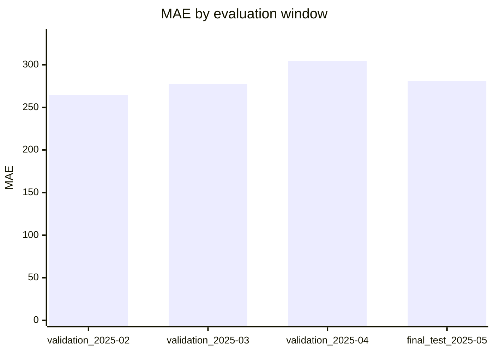
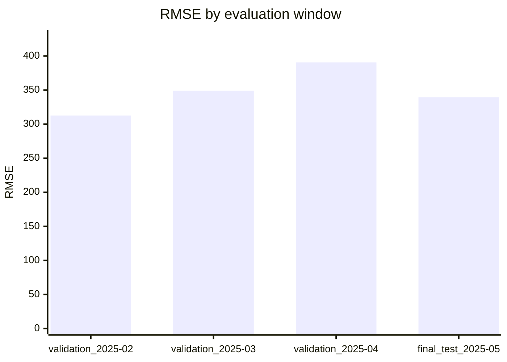
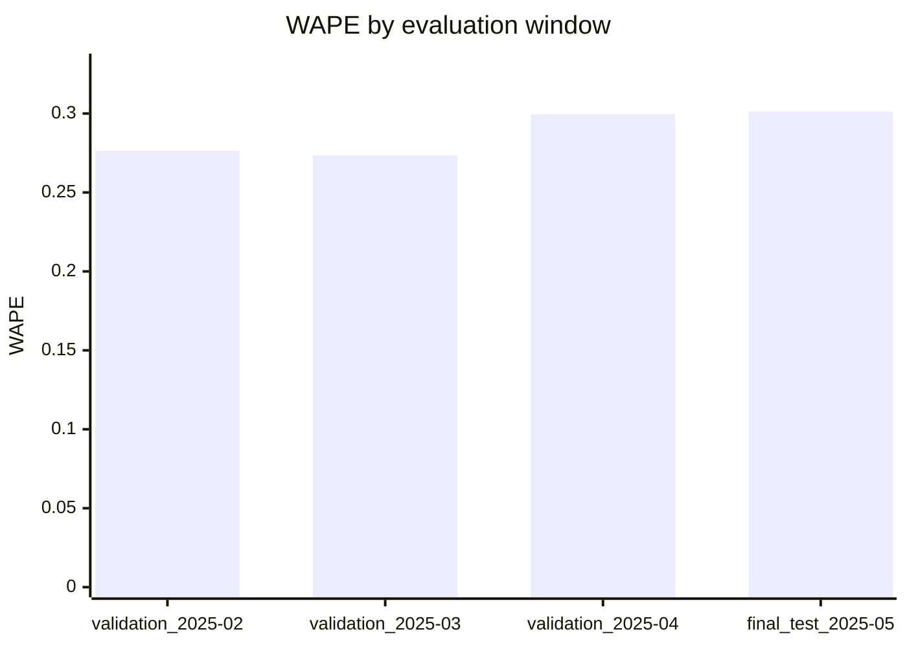

# Ridge Evaluation Report

Source: `data\processed\real_demo\supervised_rows.csv`

Rows evaluated: 87000
Validation windows: 3

## Final test

Window: `final_test_2025-05`
Period: 2025-05-01T00:00:00+10:00 to 2025-06-01T00:00:00+10:00
Training rows: 68820

| Metric | Value |
| --- | ---: |
| Row count | 17856 |
| MAE | 280.7997 |
| RMSE | 339.3547 |
| WAPE | 0.3013 |

## Model comparison

| Window | Model | Rows | MAE | RMSE | WAPE | Relative WAPE improvement |
| --- | --- | ---: | ---: | ---: | ---: | ---: |
| final_test_2025-05 | Ridge | 17856 | 280.7997 | 339.3547 | 0.3013 | -170.41% |
| final_test_2025-05 | Seasonal Naive | 17856 | 103.8441 | 191.4734 | 0.1114 | n/a |
| validation_2025-02 | Ridge | 16128 | 264.2488 | 312.5872 | 0.2764 | -157.49% |
| validation_2025-02 | Seasonal Naive | 16128 | 102.6235 | 176.2095 | 0.1073 | n/a |
| validation_2025-03 | Ridge | 17856 | 277.6614 | 348.9847 | 0.2736 | -114.65% |
| validation_2025-03 | Seasonal Naive | 17856 | 129.3562 | 270.2339 | 0.1274 | n/a |
| validation_2025-04 | Ridge | 17280 | 304.6591 | 390.6336 | 0.2995 | -66.54% |
| validation_2025-04 | Seasonal Naive | 17256 | 183.1572 | 309.4902 | 0.1799 | n/a |

## Validation windows

| Window | Period | Training rows | Rows | MAE | RMSE | WAPE |
| --- | --- | ---: | ---: | ---: | ---: | ---: |
| validation_2025-02 | 2025-02-01T00:00:00+11:00 to 2025-03-01T00:00:00+11:00 | 17556 | 16128 | 264.2488 | 312.5872 | 0.2764 |
| validation_2025-03 | 2025-03-01T00:00:00+11:00 to 2025-04-01T00:00:00+11:00 | 33684 | 17856 | 277.6614 | 348.9847 | 0.2736 |
| validation_2025-04 | 2025-04-01T00:00:00+11:00 to 2025-05-01T00:00:00+10:00 | 51540 | 17280 | 304.6591 | 390.6336 | 0.2995 |

## Metric comparison charts

## Final test by horizon

| Horizon | Rows | MAE | RMSE | WAPE |
| ---: | ---: | ---: | ---: | ---: |
| 1 | 744 | 281.4927 | 338.0471 | 0.3020 |
| 2 | 744 | 283.1321 | 340.7958 | 0.3038 |
| 3 | 744 | 282.8468 | 340.9595 | 0.3035 |
| 4 | 744 | 281.5591 | 340.0424 | 0.3021 |
| 5 | 744 | 281.3660 | 340.2156 | 0.3019 |
| 6 | 744 | 281.9612 | 341.0916 | 0.3025 |
| 7 | 744 | 281.4601 | 340.6083 | 0.3020 |
| 8 | 744 | 279.1504 | 337.9077 | 0.2995 |
| 9 | 744 | 277.0827 | 336.1606 | 0.2973 |
| 10 | 744 | 276.7706 | 335.8738 | 0.2969 |
| 11 | 744 | 278.3201 | 337.4753 | 0.2986 |
| 12 | 744 | 279.4661 | 338.4479 | 0.2998 |
| 13 | 744 | 279.2031 | 338.3802 | 0.2996 |
| 14 | 744 | 279.7742 | 338.8433 | 0.3002 |
| 15 | 744 | 281.4225 | 339.7007 | 0.3019 |
| 16 | 744 | 282.6592 | 340.6297 | 0.3033 |
| 17 | 744 | 283.0887 | 340.7704 | 0.3037 |
| 18 | 744 | 282.9551 | 340.4592 | 0.3036 |
| 19 | 744 | 282.2821 | 339.8538 | 0.3029 |
| 20 | 744 | 281.7756 | 339.9874 | 0.3023 |
| 21 | 744 | 281.6148 | 340.3478 | 0.3021 |
| 22 | 744 | 280.5937 | 339.8037 | 0.3011 |
| 23 | 744 | 279.5461 | 338.7738 | 0.2999 |
| 24 | 744 | 279.6691 | 339.2657 | 0.3001 |
