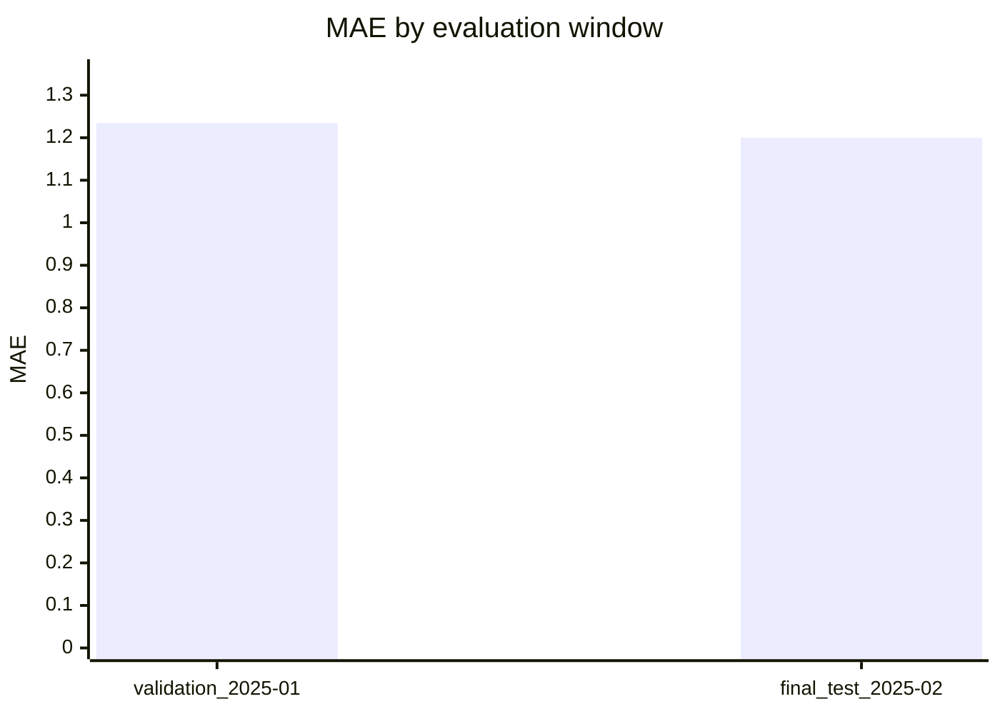
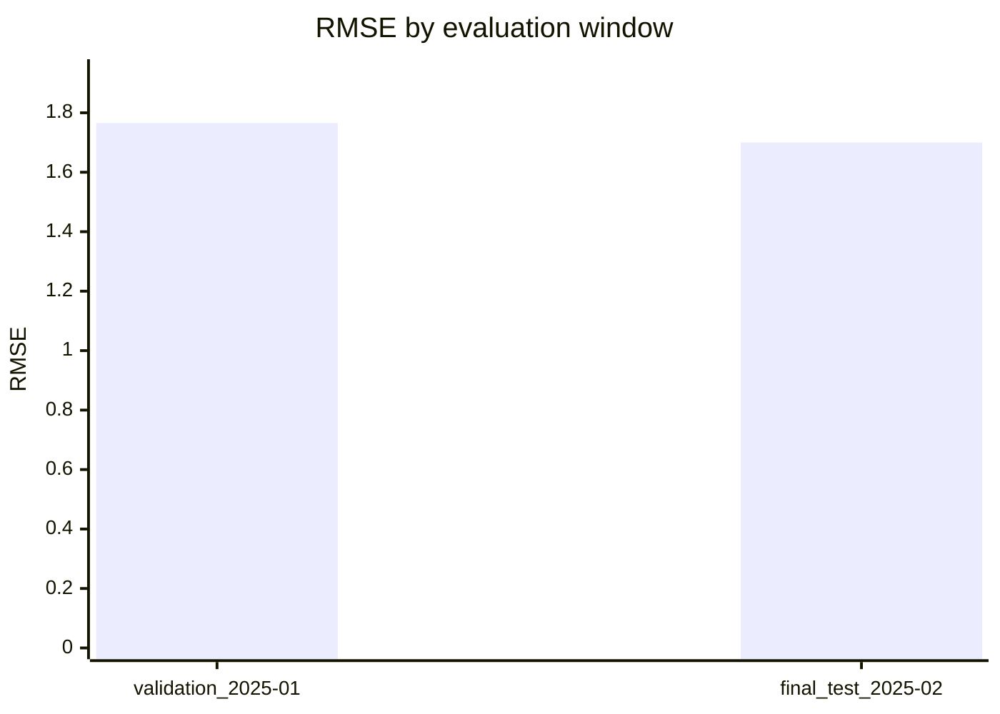
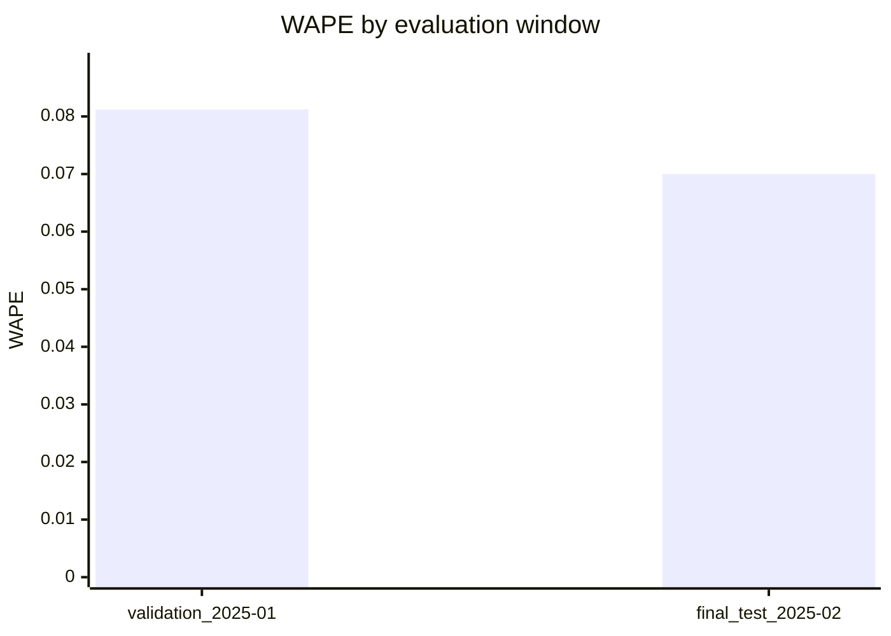

# Ridge Evaluation Report

Source: `docs/examples/modeling/synthetic_supervised_rows.csv`

Rows evaluated: 1464
Validation windows: 1

## Final test

Window: `final_test_2025-02`
Period: 2025-02-01T00:00:00+11:00 to 2025-03-01T00:00:00+11:00
Training rows: 1488

| Metric | Value |
| --- | ---: |
| Row count | 672 |
| MAE | 1.2000 |
| RMSE | 1.7000 |
| WAPE | 0.0700 |

## Model comparison

| Window | Model | Rows | MAE | RMSE | WAPE | Relative WAPE improvement |
| --- | --- | ---: | ---: | ---: | ---: | ---: |
| final_test_2025-02 | Ridge | 672 | 1.2000 | 1.7000 | 0.0700 | 26.32% |
| final_test_2025-02 | Seasonal Naive | 672 | 1.8000 | 2.3500 | 0.0950 | n/a |
| validation_2025-01 | Ridge | 744 | 1.2345 | 1.7654 | 0.0812 | 12.69% |
| validation_2025-01 | Seasonal Naive | 744 | 1.4200 | 1.9800 | 0.0930 | n/a |

## Validation windows

| Window | Period | Training rows | Rows | MAE | RMSE | WAPE |
| --- | --- | ---: | ---: | ---: | ---: | ---: |
| validation_2025-01 | 2025-01-01T00:00:00+11:00 to 2025-02-01T00:00:00+11:00 | 744 | 744 | 1.2345 | 1.7654 | 0.0812 |

## Metric comparison charts

## Final test by horizon

| Horizon | Rows | MAE | RMSE | WAPE |
| ---: | ---: | ---: | ---: | ---: |
| 1 | 336 | 1.1000 | 1.6000 | 0.0600 |
| 24 | 336 | 1.3000 | 1.8000 | 0.0800 |
