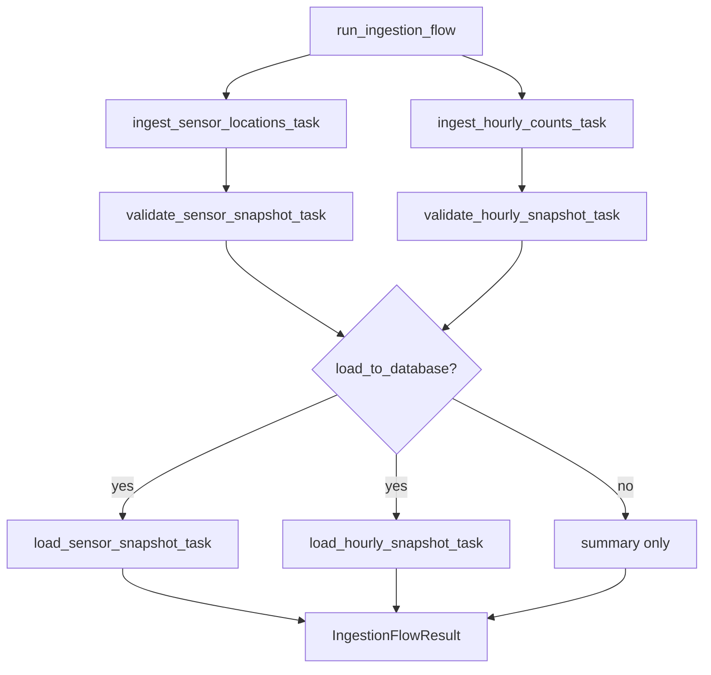

# Prefect Orchestration Design

Date: 2026-06-30

## Goal

Add the first Prefect orchestration layer for UrbanFlow AU so the existing
sensor-location ingestion, hourly-count ingestion, validation, and optional
PostgreSQL loading steps can be run as one local, observable workflow.

This closes the remaining orchestration part of delivery slice 2 without
introducing Prefect server deployment, Docker Compose, work pools, schedules, or
long-running production infrastructure.

## Current project context

The repository already has the reusable building blocks that a flow can call:

- `urbanflow.ingestion.sensor_location_pipeline.ingest_sensor_locations`
  fetches, normalizes, snapshots, and manifests the City of Melbourne sensor
  location dataset.
- `urbanflow.ingestion.hourly_count_pipeline.ingest_hourly_counts` exports a
  bounded hourly-count CSV snapshot and manifest for an explicit date range.
- `urbanflow.validation.pipeline.validate_snapshot` validates completed raw
  snapshots and can write JSON quality reports.
- `urbanflow.database.loaders.load_sensor_locations_snapshot` and
  `load_hourly_counts_snapshot` validate and upsert snapshots into PostgreSQL.
- `urbanflow.database.engine` owns SQLAlchemy engine and session factory
  creation.

The current command-line scripts run each piece separately. The orchestration
slice should connect those existing functions rather than duplicating ingestion,
validation, or database logic.

## External reference

Prefect 3 organizes workflows by decorating ordinary Python functions with
`@flow` and `@task`. A flow can be called directly in local Python for a simple
developer workflow, while deployments, schedules, and work pools can be added
in subsequent packaging and MLOps slices when the project has a reliable
runtime environment.

References:

- Prefect flows: https://docs.prefect.io/v3/concepts/flows
- Prefect tasks: https://docs.prefect.io/v3/concepts/tasks
- Prefect deployments: https://docs.prefect.io/v3/deploy

## Selected approach

Create a small `urbanflow.orchestration` package with one public flow:

`run_ingestion_flow(...)`

The flow will:

1. run sensor-location ingestion;
2. run hourly-count ingestion for an explicit year or date range;
3. validate both generated snapshots;
4. optionally load both snapshots into PostgreSQL when a database URL is
   provided;
5. return a serializable summary containing snapshot paths, manifest paths,
   validation status, warning counts, and optional database load row counts.

The implementation will keep Prefect at the orchestration boundary only.
Existing ingestion, validation, and database modules remain the source of truth
for domain behavior.

## Alternatives considered

### 1. Local Prefect flow over existing functions

This is the selected approach. It provides a real flow boundary, task-level
observability, and one command for the complete local ingestion path while
remaining easy to test without network, PostgreSQL, or Prefect server setup.

### 2. Prefect deployment with work pool and schedule now

This is closer to production automation, but it creates infrastructure questions
before Docker Compose, service configuration, and runtime secrets exist. It also
risks spending time on operational wiring before the modeling and API slices are
ready to consume scheduled outputs.

### 3. Plain Python orchestration without Prefect

This would be simpler, but it would not satisfy the project requirement for
Prefect orchestration. The project already has plain Python pipelines; this
stage should introduce the actual workflow layer.

## Package and file boundaries

### `src/urbanflow/orchestration/__init__.py`

Exports the flow result types and `run_ingestion_flow`.

### `src/urbanflow/orchestration/ingestion_flow.py`

Owns Prefect tasks, flow-level configuration, result dataclasses, and the
orchestration sequence. It calls existing ingestion, validation, and database
functions through thin task wrappers.

Expected public API:

- `IngestionFlowResult`
- `SnapshotFlowResult`
- `DatabaseFlowResult`
- `run_ingestion_flow(...)`

### `scripts/run_ingestion_flow.py`

Provides a small CLI wrapper around the flow. It mirrors existing scripts by
parsing arguments, calling a module-level `main`, printing a JSON summary, and
returning conventional exit codes.

### `tests/unit/orchestration/test_ingestion_flow.py`

Covers the flow behavior with monkeypatched task dependencies. Tests must not
download data, connect to PostgreSQL, or require a Prefect server.

### `tests/unit/orchestration/test_ingestion_flow_cli.py`

Covers CLI argument parsing, JSON output, script help, database URL optionality,
and expected orchestration errors.

### `pyproject.toml`

Adds `prefect>=3,<4` as a runtime dependency.

### `README.md`

Documents a local command that runs the flow. The documentation must make clear
that database loading is optional and only happens when a database URL is
provided.

## Flow input contract

The flow should accept:

- `raw_root_dir: Path` defaulting to `data/raw`;
- `manifest_root_dir: Path` defaulting to `data/manifests`;
- `report_root_dir: Path | None` defaulting to `reports/data_quality`;
- either `year: int` or both `start_date: date` and `end_date: date` for the
  hourly-count export;
- `page_limit: int` defaulting to `100` for sensor-location API pagination;
- `database_url: str | None` defaulting to `None`;
- `load_to_database: bool` defaulting to `False`;
- injectable API client factories so unit tests can run with fakes.

The CLI should avoid an unbounded hourly-count default. A user must provide
`--year YYYY` or both `--start-date YYYY-MM-DD` and `--end-date YYYY-MM-DD`.

## Data flow



The flow should load sensor locations before hourly counts when database loading
is enabled so the hourly fact table's foreign key can be satisfied.

## Error handling

The flow should not swallow domain errors. If ingestion, validation, or database
loading fails, Prefect should mark the task and flow as failed. The CLI should
catch expected flow-level exceptions only to print a concise stderr message and
return `1`.

Invalid local input, such as missing hourly-count date range arguments or
requesting database loading without a URL, should return `2`.

Validation behavior should stay consistent with existing modules:

- validation hard failures prevent database loading;
- validation warnings are included in the summary but do not block loading.

## Testing strategy

Automated tests remain deterministic:

- no City of Melbourne network calls;
- no PostgreSQL connection;
- no Prefect server;
- no deployment creation;
- no full data downloads.

Unit tests should patch the ingestion, validation, and database task functions
to verify call order, arguments, result aggregation, and error behavior. Script
help should be tested with `subprocess.run`, matching the pattern used by
existing command wrappers.

The final verification gate remains:

```powershell
$env:PYTHONPATH='src'
python -m ruff check . --no-cache
python -m ruff format --check .
python -m pytest
```

## Out of scope for this slice

This slice will not add:

- Prefect deployments, schedules, work pools, or agents;
- Prefect Cloud or local Prefect server setup;
- Docker Compose services;
- secrets management;
- feature engineering, model training, MLflow, API routes, dashboards, or
  monitoring;
- live network smoke tests as part of automated verification.

Those items belong to subsequent packaging, MLOps, and product slices.

## Acceptance criteria

The slice is complete when:

- Prefect is installed as a project dependency;
- `run_ingestion_flow(...)` exists and orchestrates the existing ingestion,
  validation, and optional database-loading functions;
- the CLI can run the local flow for a bounded hourly-count date range;
- default automated tests do not require network, PostgreSQL, or a Prefect
  server;
- README documents the local flow command and database-loading option;
- Ruff and pytest pass on `main`.
