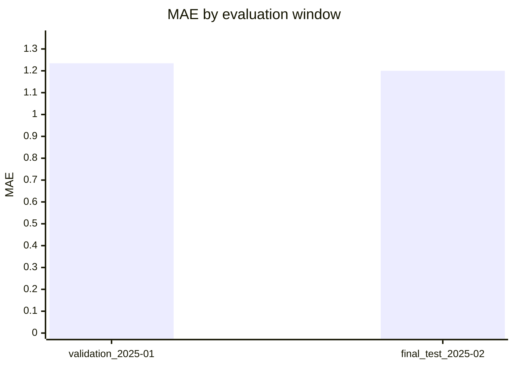
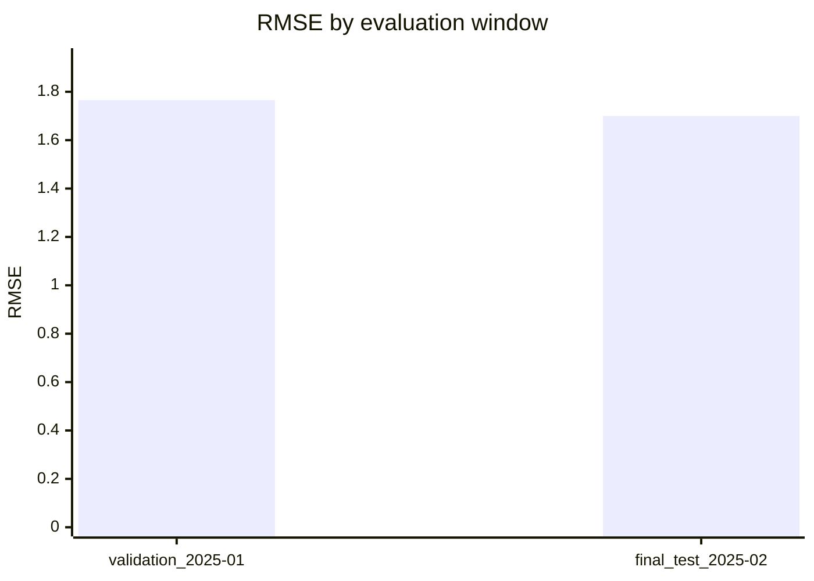
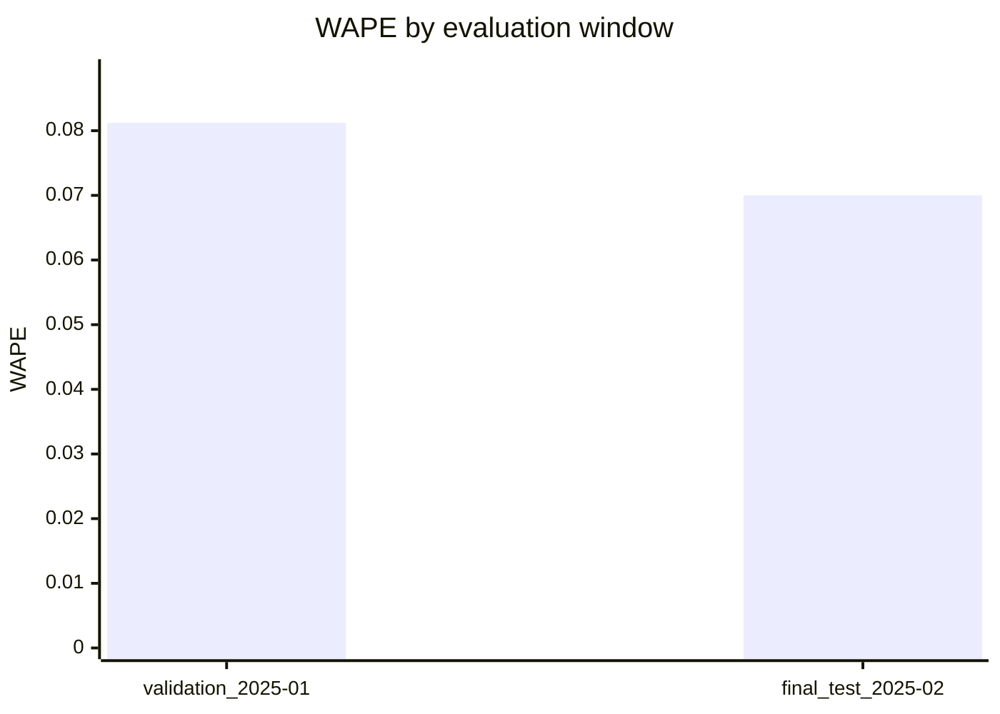

# Ridge Report Mermaid Visualization Design

Date: 2026-07-03

## Goal

Add a small visual layer to the existing Ridge evaluation Markdown report so a
reader can quickly compare validation-window and final-test metrics without
leaving the repository.

The slice should stay lightweight: generated Markdown remains the canonical
artifact, metric tables remain the reliable fallback, and no browser app, HTML
template, image export, dashboard, or new dependency is introduced.

## Current project context

The repository already has:

- `src/urbanflow/modeling/reports.py`, which validates a Ridge evaluation
  summary and renders deterministic Markdown tables;
- `src/urbanflow/modeling/report_cli.py` and
  `scripts/render_ridge_evaluation_report.py`, which turn a JSON summary into a
  report file;
- `docs/examples/modeling/ridge_evaluation_report.md`, a checked-in synthetic
  report example that is regression-tested against the renderer;
- `tests/unit/modeling/test_modeling_reports.py`, which covers renderer
  behavior, CLI behavior, script help, and checked-in example drift.

The current report is readable, but it is table-only. That is good for exact
review, yet slower for visually spotting whether final-test MAE, RMSE, or WAPE
is better or worse than validation.

## Selected approach

Extend the Markdown renderer with an optional Mermaid chart section titled
`## Metric comparison charts`.

The section should appear after `## Validation windows` and before
`## Final test by horizon`. It should contain one Mermaid `xychart-beta` block
per numeric overall metric:

- MAE by evaluation window;
- RMSE by evaluation window;
- WAPE by evaluation window.

Each chart uses the validation windows in their existing order, followed by the
final-test window. Each chart's x-axis labels are the window names, and each
bar value is the corresponding overall metric value. The existing tables remain
unchanged and continue to carry all exact values.

This keeps the report useful in three viewing modes:

1. GitHub or any Markdown renderer that supports Mermaid charts can show the
   visual comparison directly.
2. Renderers that show Mermaid as a code block still expose a readable,
   deterministic representation of the chart data.
3. Renderers that ignore Mermaid still retain all metrics in the Markdown
   tables.

## Alternatives considered

### 1. Mermaid charts inside the existing Markdown report

This is the selected approach. It produces a visible artifact while preserving
the repository-friendly Markdown workflow. It also keeps implementation scoped
to the existing renderer, tests, example report, and README guidance.

### 2. Markdown-only text bars

Text bars would render everywhere and be easy to diff, but they are less like a
real visualization and become noisy when metric scales differ. They are a good
fallback idea if Mermaid support proves too inconsistent later, but they do not
need to be built in this slice.

### 3. Standalone HTML or PNG report output

HTML or image output would look more polished immediately, but it would add a
new artifact type, rendering decisions, and likely new test tooling. That is too
large for this step. The current goal is a repository-native visual report, not
a dashboard.

## Markdown output design

The renderer should produce a deterministic section like this for the synthetic
example:

````markdown
## Metric comparison charts






````

Formatting rules:

- chart metric values use the same four-decimal formatting rule as the tables;
- y-axis upper bounds are deterministic and use 110% of the largest included
  value, formatted to four decimals;
- when every included value for a metric is `0`, the y-axis is `0 --> 1.0000`;
- Mermaid labels escape double quotes and collapse newlines to spaces;
- nonnumeric or missing metric values are excluded from Mermaid charts because
  Mermaid numeric arrays cannot represent `n/a`;
- if a metric has no numeric values, omit that metric's chart;
- if no metric charts can be rendered, omit the chart section entirely.

## Data flow

The data flow remains one-way and file-based:

1. A Ridge evaluation JSON summary is produced by the existing evaluation CLI.
2. `render_ridge_evaluation_report(summary)` validates the summary using the
   existing required-field checks.
3. The renderer builds existing final-test and validation Markdown tables.
4. The renderer derives chart rows from already-validated `overall` metrics.
5. The CLI writes one Markdown report file exactly as it does today.

The chart section must not run model evaluation, read CSV data, read from
PostgreSQL, or inspect any generated `reports/` directory.

## Component boundaries

Implementation should stay inside the existing reporting slice:

- `src/urbanflow/modeling/reports.py`
  - add small private helpers for numeric metric extraction, Mermaid label
    escaping, deterministic y-axis bounds, and Mermaid chart block rendering;
  - keep `render_ridge_evaluation_report(summary)` as the public entry point;
  - avoid introducing dataclasses unless the helper logic becomes hard to read.
- `tests/unit/modeling/test_modeling_reports.py`
  - add renderer tests that assert the chart section and expected Mermaid blocks
    are present;
  - add a test that `None` or nonnumeric metric values stay in tables but are
    omitted from charts;
  - keep the checked-in example drift test.
- `docs/examples/modeling/ridge_evaluation_report.md`
  - update the synthetic example to include the new chart section generated by
    the renderer.
- `README.md`
  - mention that the Markdown report now includes Mermaid comparison charts when
    the viewer supports Mermaid, while tables remain the source of exact values.

No new module, package dependency, or script is needed for this slice.

## Error handling

The renderer should continue to raise `RidgeReportError` only for invalid
summary structure or missing required fields.

Chart rendering should be tolerant of metric values that are present but not
numeric. Those values already render as text in Markdown tables; the chart
helpers should simply skip them for Mermaid output. This avoids turning a visual
enhancement into a stricter input contract.

## Testing strategy

Use test-driven implementation in the next phase:

- first add a failing test that the report includes `## Metric comparison
  charts`, one `xychart-beta` block per MAE/RMSE/WAPE, validation labels before
  final-test labels, and four-decimal numeric arrays;
- add a failing test for nonnumeric or `None` metric values being omitted from
  Mermaid while still appearing as `n/a` or text in tables;
- update the checked-in example and keep the existing drift test as the final
  example-artifact guard;
- run the targeted modeling report tests after each implementation step;
- run the full repository quality gate before merging to `main`.

## External references checked

- GitHub documentation says Markdown can include Mermaid diagrams using fenced
  `mermaid` code blocks:
  <https://docs.github.com/en/get-started/writing-on-github/working-with-advanced-formatting/creating-diagrams>
- Mermaid's official syntax documentation includes `xychart-beta`, which is the
  chart form proposed for this report:
  <https://mermaid.js.org/syntax/xyChart.html>

Because Mermaid support can vary by renderer and version, the Markdown tables
remain the source of truth for exact metrics.

## Out of scope

This slice intentionally does not add:

- HTML, PDF, PNG, SVG, or screenshot export;
- Streamlit, Dash, Gradio, notebook, or browser UI;
- JavaScript chart libraries;
- additional model metrics;
- comparison against Seasonal Naive or other baselines;
- metric threshold coloring or pass/fail badges;
- persistence of chart artifacts outside the Markdown report;
- changes to Ridge evaluation logic or JSON summary generation.

## Success criteria

The implementation will be successful when:

- generated Ridge Markdown reports include a deterministic Mermaid chart section
  for numeric MAE, RMSE, and WAPE overall metrics;
- all exact metrics remain available in existing Markdown tables;
- nonnumeric or missing metric values do not break report rendering;
- the checked-in synthetic report example matches the renderer output;
- README documents the Mermaid enhancement and fallback expectation;
- targeted modeling report tests and the full repository quality gate pass
  before merge, and the same gate is re-run on `main` after merge.

## Self-review

- Placeholder scan: no unresolved placeholder language or incomplete
  implementation decisions.
- Internal consistency: selected approach, output design, component boundaries,
  and tests all describe the same Mermaid-in-Markdown enhancement.
- Scope check: one renderer/reporting slice only; no frontend, export pipeline,
  or model-evaluation changes.
- Ambiguity check: chart placement, metric ordering, numeric formatting, y-axis
  bounds, and missing-value behavior are explicit.
