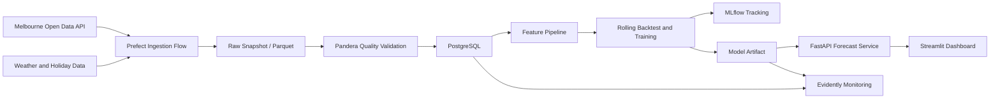

# UrbanFlow AU

## 澳大利亚城市人流预测与 MLOps 平台 - 项目大纲与开发要求

## 1. 项目定位

UrbanFlow AU 是一个面向城市运营场景的端到端数据与机器学习系统。项目使用墨尔本市政府开放的行人传感器数据，建立从数据采集、质量验证、数据库存储、时间序列建模，到预测服务、可视化和模型监控的完整流程。

该项目的目的不是再做一个普通预测 Notebook，而是展示以下能力：

- 处理真实、持续更新的大规模公共数据；
- 设计可重复运行的数据管道和数据库结构；
- 正确完成时间序列回测，避免未来信息泄漏；
- 比较基线模型与机器学习模型，并解释误差来源；
- 将模型包装为 API 和可使用的分析产品；
- 使用实验追踪、漂移监控、测试、CI 和容器化保证工程质量。

项目面向澳大利亚 Artificial Intelligence、Data Science、Information Technology 等硕士申请，同时可用于申请 Data Scientist、Machine Learning Engineer、Data Engineer 和 AI Engineer 相关岗位。

## 2. 核心问题

系统需要回答：

> 根据传感器历史人流、时间特征、公共假期和天气信息，预测墨尔本重点位置未来 24 小时的逐小时行人流量，并识别高峰时段、异常变化和模型漂移。

主要用户可以假设为城市运营人员、交通规划人员或商业选址分析人员。

## 3. 数据来源

### 3.1 必须使用的数据

1. City of Melbourne Pedestrian Counting System - Hourly Counts
   - 数据规模约 160 万条，并持续更新；开发时必须通过 API 动态读取总量，不在 README 中写死总记录数。
   - 关键字段：`location_id`、`sensing_date`、`hourday`、`pedestriancount`、`sensor_name`、`location`。
   - API：<https://data.melbourne.vic.gov.au/api/explore/v2.1/catalog/datasets/pedestrian-counting-system-monthly-counts-per-hour/records>

2. City of Melbourne Pedestrian Counting System - Sensor Locations
   - 关键字段：`location_id`、`sensor_description`、`installation_date`、`status`、`latitude`、`longitude`。
   - API：<https://data.melbourne.vic.gov.au/api/explore/v2.1/catalog/datasets/pedestrian-counting-system-sensor-locations/records>

### 3.2 推荐的增强数据

- Open-Meteo Historical Weather API：提供训练和回测所需的历史小时级天气。
  - <https://open-meteo.com/en/docs/historical-weather-api>
- Open-Meteo Forecast API：提供实际生成未来 24 小时预测时可用的天气预报，避免把未来真实天气泄漏给模型。
  - <https://open-meteo.com/en/docs>
- 澳大利亚维多利亚州公共假期：通过 `holidays` Python 包生成，不依赖人工维护的 CSV。

### 3.3 数据范围

- MVP 使用最近三个完整自然年的数据。
- 选择数据完整率最高的 10 个活跃传感器，避免一开始处理所有传感器。
- 训练集、验证集和测试集必须严格按照时间顺序划分。
- 仓库只提交小型样例数据和数据清单，不提交完整原始数据集。
- 每次正式数据提取必须记录时间范围、传感器列表、提取时间、记录数和文件哈希。

## 4. MVP 范围

### 4.1 必须完成

- 官方 API 分页采集与本地缓存；
- 数据模式、缺失值、重复值、负数、时间连续性和异常值检查；
- PostgreSQL 数据库及明确的数据表设计；
- 小时级时间序列特征工程；
- Seasonal Naive、Ridge Regression 和 LightGBM 三类模型；
- Rolling-origin 时间序列回测；
- MLflow 实验记录和模型产物管理；
- FastAPI 预测服务；
- Streamlit/Plotly 运营仪表盘；
- 数据漂移和预测性能监控报告；
- Docker Compose、本地一键启动、pytest、Ruff 和 GitHub Actions；
- 完整 README、系统设计、数据卡、模型卡和评估报告。

### 4.2 明确不做

- 不使用 Kafka、Kubernetes、Spark 或完整 Airflow 集群；
- 不做移动端应用、登录、支付和多租户权限；
- 不承诺真正的实时流式处理，MVP 使用可重复执行的批处理；
- 不训练深度学习模型，除非基础版本全部完成后仍有时间；
- 不追求覆盖全部传感器；
- 不把 LLM 或 RAG 强行加入项目。

## 5. 技术栈

| 层级 | 推荐技术 |
| --- | --- |
| 语言 | Python 3.11 |
| 数据采集 | `httpx`、`tenacity` |
| 数据处理 | `pandas` 或 `polars`，项目内统一使用一种 |
| 数据验证 | `pandera` |
| 数据库存储 | PostgreSQL、SQLAlchemy、Alembic |
| 工作流编排 | Prefect |
| 建模 | scikit-learn、LightGBM |
| 实验追踪 | MLflow |
| 漂移监控 | Evidently |
| API | FastAPI、Pydantic |
| 可视化 | Streamlit、Plotly |
| 工程化 | Docker Compose、pytest、Ruff、GitHub Actions |

默认建议使用 `pandas`，把项目重点放在数据管道、时间序列验证和 MLOps，而不是为了增加名词临时切换数据框架。

## 6. 系统架构



## 7. 数据库设计

至少建立以下数据表：

### `sensor_dim`

- `location_id`：主键；
- `sensor_name`；
- `sensor_description`；
- `latitude`、`longitude`；
- `installation_date`；
- `status`；
- `updated_at`。

### `pedestrian_hourly_fact`

- `location_id`；
- `observed_at`：带时区的小时级时间；
- `pedestrian_count`；
- `direction_1_count`、`direction_2_count`；
- `ingested_at`；
- 联合唯一键：`location_id + observed_at`。

### `weather_hourly_fact`

- `observed_at`；
- `temperature_c`；
- `precipitation_mm`；
- `wind_speed_kmh`；
- `weather_code`。

### `forecast_fact`

- `model_version`；
- `location_id`；
- `forecast_created_at`；
- `target_at`；
- `predicted_count`；
- `actual_count`，获得真实值后回填；
- `prediction_interval_lower`、`prediction_interval_upper`，可选。

数据库迁移必须由 Alembic 管理，不允许只依赖手工建表。

## 8. 数据管道要求

### 8.1 采集

- 初次历史回填使用带日期和传感器过滤条件的官方导出接口，避免用 records endpoint 对百万级数据执行低效深分页；
- 日常增量采集使用 records endpoint 分页，并支持日期过滤和传感器过滤；
- 设置超时、指数退避重试和最大重试次数；
- 原始响应保存为不可修改的日期分区 Parquet 快照；
- 重复运行同一时间范围时必须保持幂等，不重复写入数据库；
- API 暂时不可用时允许读取最近一次有效快照，并明确标记数据陈旧状态。

### 8.2 数据质量

至少检查：

- 必要字段是否存在以及类型是否正确；
- `location_id + observed_at` 是否重复；
- `pedestrian_count` 是否为负数；
- 每个传感器的缺失小时比例；
- 传感器状态和地理坐标是否有效；
- 极端值是否超过训练数据合理范围；
- 最近数据时间与当前时间的差距。

质量检查失败时不得静默进入训练。系统应生成机器可读 JSON 和人类可读 Markdown 报告。

### 8.3 特征工程

必须包括：

- 小时、星期、月份、周末、公共假期；
- 小时和星期的正余弦周期编码；
- `lag_1`、`lag_24`、`lag_168`；
- 过去 24 小时和 168 小时的滚动均值及标准差；
- 传感器 ID；
- 温度、降雨和风速；
- 缺失标记。

所有滞后和滚动特征只能使用预测时间之前的数据，并使用自动化测试防止时间泄漏。

## 9. 模型与评估

### 9.1 模型

1. **Seasonal Naive**：使用一周前同一小时的客流作为预测；
2. **Ridge Regression**：作为可解释的线性基线；
3. **LightGBM Global Model**：使用多个传感器共同训练的主模型。

Ridge 和 LightGBM 统一采用直接多步预测：训练数据为每个预测起点生成 `forecast_horizon=1..24` 的样本，并直接预测对应未来小时的目标值。不得在同一次 24 小时预测中把前一步模型预测偷偷当成真实滞后值。

模型输出不得为负数，预测后应裁剪为零或使用适当的目标变换。

### 9.2 时间划分

- 不允许随机划分；
- 最后一个完整月份作为最终测试集；
- 测试集之前的 2 至 3 个月用于 rolling-origin 验证；
- 所有预处理器只在对应训练窗口拟合；
- 最终测试集只评估一次。

### 9.3 指标

- MAE；
- RMSE；
- WAPE，作为主业务指标；
- 各传感器 WAPE；
- 各小时段和工作日/周末误差；
- 高峰时段 Top 10% 样本的 MAE。

不预先虚构模型成绩。主模型的目标是相对 Seasonal Naive 降低至少 5% 的总体 WAPE；如果未达到，必须如实分析原因，而不是修改测试集。

### 9.4 实验追踪

MLflow 至少记录：

- 数据版本和时间范围；
- 特征版本；
- 模型参数；
- 每个回测窗口的指标；
- 汇总指标；
- 特征重要性图；
- 训练耗时；
- 模型文件和评估报告。

## 10. API 要求

必须提供以下端点：

- `GET /health`：服务、模型、数据库和数据新鲜度；
- `GET /api/v1/sensors`：可用传感器及位置；
- `GET /api/v1/sensors/{location_id}/history`：指定时间范围的历史人流；
- `GET /api/v1/sensors/{location_id}/forecast?horizon=24`：未来 1 至 24 小时预测；
- `GET /api/v1/model/metrics`：模型版本和测试集指标。

`/health` 保持未版本化，业务路由统一位于 `/api/v1`。FastAPI 服务代码位于
`src/urbanflow/api`，首个切片先稳定 HTTP 契约；数据库读取、模型产物加载和生产预测
provider 仍须在后续切片显式接入。

API 要求：

- 使用 Pydantic 定义输入输出；
- 对非法传感器、非法时间范围和缺失模型返回明确错误；
- 自动生成 OpenAPI 文档；
- 预测响应包含模型版本、生成时间和数据截止时间；
- API 单元测试和集成测试必须覆盖成功与失败路径。

## 11. Dashboard 要求

### Overview

- 数据最新时间、传感器数量、模型版本、总体 WAPE；
- 过去 24 小时总人流和预测高峰时间；
- 当前数据质量与漂移状态。

### Sensor Explorer

- 墨尔本地图和传感器位置；
- 可按位置选择传感器；
- 历史人流趋势、日内模式和星期模式；
- 缺失数据与异常值提示。

### Forecast

- 未来 24 小时预测曲线；
- 历史真实值与预测值对比；
- 高峰时段提示；
- 可选择模型进行基线比较。

### Monitoring

- 最近回测和最终测试指标；
- 分传感器误差；
- 特征漂移和预测漂移；
- 数据新鲜度、缺失率和异常记录数。

界面应面向重复使用的运营工具设计，保持紧凑、可扫描，不制作营销式首页。

## 12. 监控与异常处理

### 数据漂移

- 使用训练集作为参考窗口；
- 使用最近完整月份作为当前窗口；
- 监控人流分布、天气、时间特征和关键滞后特征；
- 输出 HTML 或 Markdown 漂移报告；
- 漂移超过阈值时在 Dashboard 显示警告，但不自动重训。

### 性能监控

- 当真实值可用后计算最近 7 天和 30 天 WAPE；
- 与测试集基准和 Seasonal Naive 比较；
- 明确区分数据漂移和模型性能下降。

### 降级策略

- 主模型无法加载：切换至 Seasonal Naive；
- 数据库暂时不可用：Dashboard 显示错误状态，不伪造预测；
- 天气预报 API 不可用：使用最近一次有效预报或缺失标记，绝不使用事后获得的未来真实天气；
- 数据质量检查失败：停止训练并保留上一个稳定模型。

## 13. 仓库结构

```text
urbanflow-au/
├── .github/workflows/ci.yml
├── app/
│   └── streamlit_app.py
├── data/
│   ├── README.md
│   ├── sample/
│   └── manifests/
├── docker/
├── docs/
│   ├── architecture.md
│   ├── data_card.md
│   ├── model_card.md
│   ├── api_examples.md
│   └── resume_entry.md
├── migrations/
├── models/
│   └── .gitkeep
├── reports/
│   ├── evaluation_report.md
│   ├── data_quality_report.md
│   └── figures/
├── src/urbanflow/
│   ├── config.py
│   ├── ingestion/
│   ├── validation/
│   ├── database/
│   ├── features/
│   ├── modeling/
│   ├── api/
│   │   ├── app.py
│   │   ├── dependencies.py
│   │   ├── errors.py
│   │   ├── schemas.py
│   │   ├── services.py
│   │   └── routers/
│   │       ├── health.py
│   │       ├── sensors.py
│   │       ├── forecasts.py
│   │       └── models.py
│   ├── monitoring/
│   └── orchestration/
├── tests/
│   ├── unit/
│   ├── integration/
│   └── fixtures/
├── .env.example
├── Dockerfile
├── docker-compose.yml
├── Makefile
├── pyproject.toml
└── README.md
```

## 14. 测试要求

必须包含：

- API 响应解析和分页测试；
- 数据模式与质量规则测试；
- 数据库幂等写入测试；
- 时间特征、滞后特征和滚动特征测试；
- 防止未来信息泄漏的专门测试；
- Seasonal Naive 和模型训练 smoke test；
- 回测窗口边界测试；
- FastAPI 正常与异常响应测试；
- 模型缺失时的降级测试；
- Streamlit 导入或启动 smoke test；
- Docker 构建检查。

CI 中使用小型固定样例，不下载完整数据，也不运行长时间模型训练。

## 15. README 要求

README 第一屏应清楚展示：

- 一句话项目定义；
- 一张真实 Dashboard 截图；
- 最新数据范围和模型指标；
- `docker compose up --build` 启动方式；
- 在线演示地址，如已部署。

README 还必须包含：

- 项目动机与用户场景；
- 系统架构图；
- 数据来源和许可证说明；
- 数据管道；
- 时间序列验证方法；
- 模型对比表；
- API 示例；
- Dashboard 截图；
- 测试与 CI；
- 局限性；
- 可复现实验命令；
- 不夸大结果的项目总结。

## 16. 验收标准

项目只有同时满足以下条件才算完成：

- 新环境可以按照 README 成功启动；
- 数据采集流程可以分页拉取官方数据并生成 manifest；
- 重复执行不会产生重复数据库记录；
- 数据质量失败会阻止训练；
- 三类模型完成相同时间窗口的公平比较；
- 最终指标来自未参与调参的时间测试集；
- MLflow 中能够查看参数、指标和模型产物；
- FastAPI 能返回真实模型预测及元数据；
- Dashboard 四个页面均使用真实管道输出；
- 漂移报告可以被重复生成；
- 测试、Ruff 和 GitHub Actions 全部通过；
- Docker Compose 能启动 PostgreSQL、API、MLflow 和 Dashboard；
- README 包含截图、指标、架构和一条完整演示路径；
- 仓库中不存在密钥、大型原始数据和无法解释的生成文件。

## 17. 3-4 周开发计划

### 第 1 周：数据系统

- 初始化仓库、配置、日志、测试和 CI；
- 实现官方 API 分页采集、缓存和 manifest；
- 建立 Pandera 规则；
- 建立 PostgreSQL、SQLAlchemy 模型和 Alembic 迁移；
- 完成 Prefect ingestion flow。

### 第 2 周：预测系统

- 完成数据分析和传感器筛选；
- 实现无泄漏特征工程；
- 实现 Seasonal Naive、Ridge 和 LightGBM；
- 完成 rolling-origin 回测；
- 接入 MLflow，形成首版评估报告。

### 第 3 周：产品与 MLOps

- 实现 FastAPI；
- 实现 Overview、Sensor Explorer、Forecast 和 Monitoring；
- 完成 Evidently 漂移报告；
- 完成 Docker Compose 和降级策略；
- 补齐单元测试与集成测试。

### 第 4 周：作品集包装

- 执行最终数据快照、模型训练和一次性测试集评估；
- 优化 README、架构图、截图、数据卡和模型卡；
- 清理仓库和敏感信息；
- 可选部署轻量演示版本；
- 编写简历条目和 90 秒演示脚本。

## 18. 加分项优先级

只有 MVP 全部通过后再按顺序增加：

1. Streamlit Community Cloud 或 Render 在线演示；
2. 预测区间或分位数预测；
3. GitHub Actions 定时拉取小规模最新数据；
4. SHAP 解释不同时间和传感器的人流驱动因素；
5. 自动生成模型比较报告；
6. 扩展到更多传感器。

不建议在 3-4 周内加入深度学习、Kafka 或 Kubernetes。

## 19. 申请与简历表达

### 中文简历参考

构建基于墨尔本市政府开放数据的城市人流预测与 MLOps 平台，完成 API 分页采集、Pandera 数据质量验证、PostgreSQL 存储及 Prefect 批处理编排；基于严格时间回测比较 Seasonal Naive、Ridge 与 LightGBM，并通过 MLflow 管理实验和模型产物。

将预测模型部署为 FastAPI 服务和 Streamlit 运营仪表盘，支持传感器地图、未来 24 小时人流预测、分位置误差分析及 Evidently 数据漂移监控；使用 Docker Compose、pytest、Ruff 和 GitHub Actions 建立可复现工程流程。

最终简历中的模型指标必须在项目实际完成后填写，不得提前使用目标值。

### English CV Reference

Built an end-to-end urban pedestrian demand forecasting and MLOps platform using City of Melbourne open data, covering paginated API ingestion, schema validation, PostgreSQL storage, Prefect orchestration, leakage-safe feature engineering, and rolling-origin evaluation of seasonal, linear, and LightGBM models.

Served 24-hour forecasts through FastAPI and a Streamlit operations dashboard with sensor-level analytics, experiment tracking, and data-drift monitoring; packaged the stack with Docker Compose and validated it through automated tests and GitHub Actions.

## 20. 成功标准

这个项目最重要的成果不是单一模型分数，而是让申请审核者或面试官能够从 GitHub 明确看到：

1. 你能处理真实且不整洁的公共数据；
2. 你理解时间序列验证和数据泄漏问题；
3. 你能将数据科学代码组织成可维护系统；
4. 你能部署、测试和监控模型；
5. 你能够把技术结果转化为城市运营决策信息。
